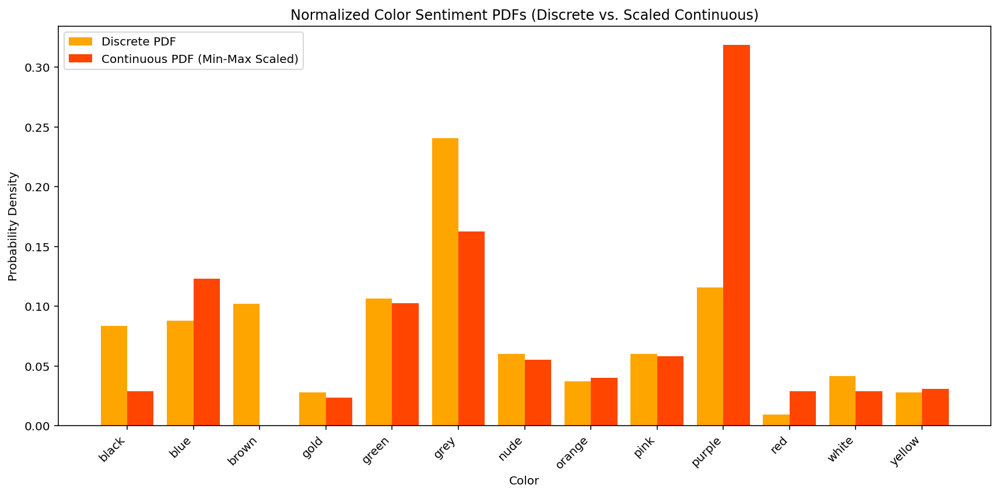
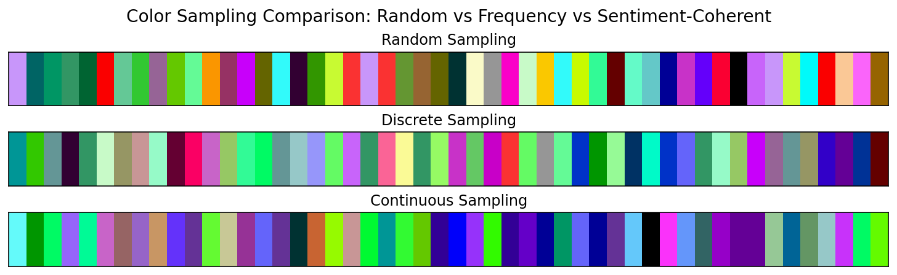

# Semantic-Color-Math

*A practical framework for mapping color, sentiment, and symbolism into computational form — with reproducible stats, evaluators, and generative samplers.*

> La Matriz Consulting Color Oracle GPT treats color as a **co-expressive interface**—linking “inner knowing” with outer data, using accessible math to create free-choice maps of symbolic resonance.&#x20;
> Core hypothesis: embedding **symbolic color transitions** inside LLM prompts improves alignment for **clarity**, **creativity**, and **relevance**.&#x20;

## Contents

* [Why this repo](#why-this-repo)
* [Repository structure](#repository-structure)
* [Methods](#methods)
* [Key results](#key-results)
* [Interpretation](#interpretation)
* [Limitations](#limitations)
* [Roadmap: RAGs & agents](#roadmap-rags--agents)
* [Roadmap: Sentiment anchoring](#roadmap-sentiment-anchoring)
* [Roadmap: Persistent homology (TDA)](#roadmap-persistent-homology-tda)
* [Credits & links](#credits-links)

---

## Why this repo

This project operationalizes **Semantic Color Math**—a way to encode symbolic/emotional meaning using color distributions and transitions. It offers a **reproducible pipeline** to:

* derive **discrete** (frequency) vs **continuous** (sentiment-weighted) color PDFs,
* generate color **sequences** via different samplers,
* evaluate coherence with statistical tests, and
* fit simple predictive models from **RGB → meaning/sentiment**.

Philosophically, the system was built to **reclaim the technological field into emotional logic** and to “map sentimental nuance into computational syntax” rather than replicate extractive metrics.&#x20;

---

## Repository structure

```
Semantic-Color-Math/
├─ analysis/                      # analysis & plots 
├─ applications/                  # fun stuff
├─ core/                          # package code
├─ visualizations/                
├─ data/                          # color names, RGB, and sentiment scores
├─ LICENSE               
└─ README.md
```

---

## Methods

### 1) Discrete vs. Continuous weighting

* **Discrete** weight $w_d(c)=\frac{\text{count}(c)}{\sum_c \text{count}(c)}$.
* **Continuous** weight starts with summed sentiment per color $s(c)=\sum \text{sentiment}_i$.
  To obtain a valid PDF we **min-max scale** to $[0,1]$ then renormalize:

  $$
  \tilde{s}(c)=\frac{s(c)-\min s}{\max s-\min s},\quad
  w_s(c)=\frac{\tilde{s}(c)}{\sum_c \tilde{s}(c)}.
  $$

### 2) Samplers

* **Random** (uniform over RGB or color names)
* **Discrete** (draw by $w_d$)
* **Continuous** (draw by $w_s$)

### 3) Coherence metric

* **RGB variance** across a sequence (lower = more visually coherent).

### 4) Statistical tests & models

* Two OLS regressions:

  * **RGB → Color-Word Similarity** (semantic): $R^2=0.174$; **G** and **B** positive, **R** ns.
  * **RGB → Sentiment Score** (emotional valence): $R^2=0.380$; **B** positive, **G** negative, **R** ns.
* **Sequence coherence t-test**: La Matriz vs Random.

---

## Key results

### A) Discrete vs Continuous color weights


* **Purple**: not most frequent, but **dominant** in sentiment weight.
* **Brown, Gold**: reasonable frequency but **negative** continuous weight.
* **Grey**: most frequent; sentiment-neutralish.
* **Blue/Green**: aligned between frequency and positive sentiment.

### B) Normalized PDFs (Continuous min-max)



* Rescaling retains sentiment contrasts; **purple** remains the emotional standout.

### C) Sampling comparison (variance ↓ = coherence ↑)



| Method     | RGB Variance |
| ---------- | -----------: |
| Random     |      8131.33 |
| Discrete   |      5696.33 |
| Continuous |      6437.67 |

### D) Sequence coherence t-test

* Mean coherence (La Matriz): **0.573**
* Mean coherence (Random): **0.665**
* t = **−0.604**, p = **0.554** → *fail to reject H₀* (under this metric).

### E) Cluster color character (95% CIs, RGB)

* Tight, non-overlapping intervals indicate **statistically distinct color groups** (e.g., Cluster 0: high-yellow; Cluster 3: pure blue/purple).

### F) Regression summaries

* **RGB → Semantic similarity**: $R^2=0.174$. **G** and **B** significant (+); **R** ns.
* **RGB → Sentiment**: $R^2=0.380$. **B** significant (+), **G** significant (−), **R** ns.
  Diagnostics: residuals slightly non-normal; DW \~1–1.3.

---

## Interpretation

* **Frequency ≠ meaning.** Purple is **emotionally potent**; grey is **ubiquitous** but not sentiment-rich.
* **Cool colors carry meaning.** Green/blue predict *semantic* resonance; blue strongly predicts *positive sentiment*.
* **Coherence metric matters.** The negative result on the t-test likely reflects a metric (pairwise color similarity) that underrates **semantic** or **narrative** cohesion.

These choices support my thesis that color can be a **semantic interface** and that **symbolic transitions** shape alignment beyond raw tokens. &#x20;

---

## Limitations

* Current coherence relies on **visual proximity**; it may miss **emotional** or **metaphoric** structure.
* Linear OLS may underfit (no interactions or nonlinearity).
* Sentiment scores require **anchoring** across datasets to avoid drift.

---

## Roadmap: RAGs & agents

### Knowledge base (RAG)

* **Corpus**: color metaphors, cultural notes, user reflections, cluster summaries, and evaluation rubrics (BLEU/ROUGE/GPTEval + qualitative).&#x20;

### Agentic loop

* **Palette Agent**: proposes sequences given goal sentiment/theme.
* **Retriever**: injects top-k color symbols & transitions into the prompt.
* **Critic/Evaluator Agent**: scores output against **semantic anchors** and rubric; triggers revisions.
* **Sampler Agent**: runs discrete vs continuous vs hybrid sampling; logs outcomes.

> Goal: **closed-loop improvement** where each generation updates the KB with outcomes and human ratings (future on-chain UBI/SoulCoin concept lives here as a platform extension). &#x20;

---

## Roadmap: Sentiment anchoring

**Why**: stabilize sentiment across corpora/models; prevent drift.

1. **Anchor sets**: fixed exemplars per pole (e.g., {purple, blue, green}+, {brown, gold, red}− based on findings).
2. **Calibration**:

   * **Z-scoring** within batch;
   * **Temperature/Platt scaling** against anchor distributions;
   * **Bayesian hierarchical model**: color-level priors, sequence-level posteriors.
3. **Drift detection**: monitor KL divergence of live scores vs. anchored baseline.
4. **Hybrid weight**: $w_\lambda = \lambda w_s + (1-\lambda) w_d$ with $\lambda$ tuned by validation against human ratings.

---

## Roadmap: Persistent homology (TDA)

**Goal**: capture **shape** of the color–sentiment manifold beyond pairwise similarity.

* Embed colors (and sequences) in $\mathbb{R}^n$ (e.g., $[R,G,B,\text{sentiment},\text{cluster}]$).
* Build **Vietoris–Rips** filtrations over distance thresholds.
* Compute **H₀/H₁/H₂** barcodes with `ripser` / `giotto-tda`.
* Define a **Topological Cohesion Score**: area under barcode for H₀ persistence minus spurious H₁/H₂ noise (or Bottleneck/Wasserstein distances to a curated “ideal” manifold).
* Compare La Matriz vs. Random: expect **fewer small components** (more connectivity) and **stable 1-cycles** reflecting meaningful transitions.

---

## Reproducible scripts

* WIP, TBA

---

## Credits & links<br>
Research & writing: La Matriz Consulting <br>
Oracle (ChatGPT custom GPT): https://chatgpt.com/g/g-686180b5d47c8191bdbb1922b79a2ebb-la-matriz-consulting-color-oracle<br>
Website: https://lamatriz.ai<br>
Contact: danielle.gauthier@lamatriz.ai<br>
“Not an answer — a mirror.”
